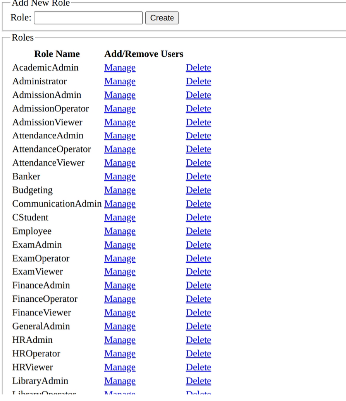

# Multiple Vulnerabilities in College ERP System (Redacted) – Responsible Disclosure

## Author
**Sarbagya Ratna Maharjan**  
Cybersecurity Enthusiast

## Overview

Between May and June 2025, I discovered and responsibly disclosed **four different vulnerabilities** in a college's ERP system, some of which exposed highly sensitive data of students and staff. All issues were reported have since been patched. These include broken access controls, document leaks, privilege escalation.

This write-up summarizes each finding with redacted and anonymized technical details to preserve confidentiality and uphold ethical disclosure standards.

## Disclosure Timeline

| # | Date       | Vulnerability                                 |
|---|------------|-----------------------------------------------|
| 1 | May 11     | Super Admin Access via Broken Access Control  |
| 2 | May 29     |Student Document Leak + SMS Messaging Interface Access                       |
| 3 | May 31     | HR Report Access via Broken Access Control    |
| 4 | June 14    | Direct URL Access to Student Docs (No Auth)   |

## Vulnerability Details

### 1. Super Admin Access via Broken Access Control

- **Type:** Broken Access Control / Privilege Escalation

- **Summary:** An administrative interface was left exposed without proper authentication or role checks. This allowed direct access to high-privilege functionalities.

- **Impact:**

  - Full access to user account management
  - Ability to manipulate user roles
  - Unrestricted access to administrative control panels

- Fix Recommendation:

  - Restrict access to admin panels with strong role validation
  - Enforce authentication for all sensitive endpoints

#### Screenshot (Redacted)

### 2. Student Document Leak + SMS Messaging Interface Access

- **Type:** Broken Access Control
  
- **Summary:** Lack of authorization checks allowed access to:  
  - Uploaded student documents (e.g., admission files, certificates, citizenship)  
  - The ERP’s SMS messaging interface used for sending bulk messages, notices, and fee payment alerts to students along with the log of sent messages
    
- **Impact:**
  
  - Exposure of personal and academic records  
  - Potential misuse of the SMS system to send unauthorized messages
    
- **Fix Recommendation:**
  
  - Apply access control checks based on user roles and IDs  
  - Isolate document access by user/session context  
  - Restrict SMS interface access to authorized personnel only
#### Screenshot (Redacted)
 

  

### 3. HR Report Access via Broken Access Control
- **Type:** Broken Access Control

- **Summary:** An internal report viewing interface allowed access to sensitive HR reports without verifying the user's role or privilege level. The backend report-fetching endpoint could be accessed directly and lacked proper access control, allowing any authenticated user to retrieve confidential employee data.

- Data Exposed:

  - Full names and employment info
  - Bank account details, SSF/CIT numbers, PAN numbers

- Fix Recommendation:

  - Implement access validation on all report exports
  - Use session-bound or signed URLs with authorization middleware
#### Screenshot (Redacted)

### 4. Direct URL Access to Student Files (Bypass Patch)

- Type: Insecure Direct File Access

- Summary: Even after patching document access, files remained retrievable via predictable URLs. No session or login was required.

- Impact:

  - Anyone with or able to guess the URL could access private files

- Fix Recommendation:

  - Move files out of public directories
  - Use signed, time-bound download tokens for access

#### Screenshot (Redacted)

### Ethical Disclosure Statement

This repository serves purely as an educational, redacted, and anonymized technical disclosure. No live URLs, identifiable organization names, or sensitive personal information have been shared. All vulnerabilities were discovered passively through legal means and disclosed responsibly.

### Contact

Got feedback or want to collaborate on projects? Feel free to connect:
- [LinkedIn](https://www.linkedin.com/in/sarbagya-maharjan-68409222b/) 
